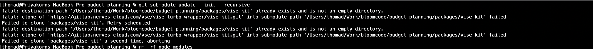

[[_TOC_]]

# Budget Planning - Installation & Setup Guide

💼 คู่มือการติดตั้ง & ตั้งค่า Budget Planning

## Prerequisites

Before setting up the **Budget Planning** project, ensure you have the following installed:

- **Node.js** (Recommended: Latest LTS version)
- **npm** (Bundled with Node.js)
- **Git**

---

### 📌 1️⃣ Clone the Repository

To clone the repository with submodules:

```bash
git clone --recurse-submodules https://gitlab.nerves-cloud.com/vse/vise-turbo-wrapper/budget-planning.git
cd budget-planning
```

If you already cloned the repository but didn't include submodules, run:

```bash
git submodule update --init --recursive
```

### 📌 2️⃣ Install Dependencies

First, install the main project dependencies:

```bash
npm install
```

### 📌 3️⃣ Keep Submodules Updated

When updating your project, pull the latest changes and update submodules:

```bash
git pull --recurse-submodules
git submodule update --remote --merge
```

### 📌 4️⃣ Running the Development Server

To start the Budget Planning application:

```bash
npm run dev
```

อย่าลืม update .env

🚀 You're now ready to start developing with Budget Planning! 🚀

---

---

## 📌 ขั้นตอนการอัปเดต Submodule ในโปรเจคหลัก

หากมีการแก้ไข submodule (@vise/kit) และต้องการอัปเดตไปยังโปรเจคหลักและให้ทีมอื่นใช้งานได้ ให้ทำตามขั้นตอนดังนี้

### 1: Commit และ Push ใน Submodule

```bash
cd packages/vise-kit  # หรือ path ของ submodule ที่ใช้

# ตรวจสอบว่าอยู่ที่ branch ที่ถูกต้อง
git checkout main  # หรือ branch ที่ใช้งานอยู่

# เพิ่มการเปลี่ยนแปลงทั้งหมด
git add .

# Commit การเปลี่ยนแปลง
git commit -m "🔄 Update vise-kit: ปรับปรุง API และเพิ่ม React Query"

# Push ไปยัง remote repository ของ submodule
git push origin main
```

✅ ตอนนี้การเปลี่ยนแปลงของ @vise/kit ถูกส่งไปยัง remote แล้ว

### 2: อัปเดต Submodule ในโปรเจคหลัก

📌 กลับไปที่โปรเจคหลัก แล้วอัปเดต Submodule

```bash
cd ../../  # กลับไปที่ root ของโปรเจคหลัก

# ดึงการอัปเดตจาก remote submodule
git submodule update --remote --merge

# ตรวจสอบว่า submodule อัปเดตแล้ว
git status
```

✅ ตอนนี้โปรเจคหลักใช้ @vise/kit เวอร์ชันล่าสุดแล้ว

### 3: Commit และ Push การเปลี่ยนแปลงในโปรเจคหลัก

📌 เพิ่มการอัปเดตของ submodule ลงในโปรเจคหลัก

```bash
git add packages/vise-kit  # หรือ path ของ submodule ที่อัปเดต
git commit -m "⬆️ Update submodule: นำเข้าการเปลี่ยนแปลงของ @vise/kit"
git push origin main  # หรือ branch ที่ต้องการอัปเดต
```

ข้อสังเกต จะเกิด change file ที่ `packages/vise-kit` เป็น commit latest

## 📌 ขั้นตอน pull submodule ล่าสุด

```bash
git pull origin main  # หรือ branch ที่ต้องการอัปเดต
git submodule update --init --recursive
```

### 📌 6️⃣ Troubleshooting

#### Submodule Not Found or Empty

If you see missing files in `packages/vise-kit`, ensure submodules are initialized:

```bash
git submodule update --init --recursive
```

⚠️ Dependency Issues

Try running:

```bash
rm -rf node_modules package-lock.json
npm install
```

#### Tailwind Argent (ENV Windows x64 or ARM) !!

ถ้าติด `Error: Cannot find module '@tailwindcss/oxide-win32-x64-msvc'` ใน **Tailwind CSS** (Windows)

- ลองลบ package-lock ดู เเล้วลอง install (package-lock เป็นการ lock version ของ dependencies)
- ลองโหลด https://learn.microsoft.com/en-us/cpp/windows/latest-supported-vc-redist?view=msvc-170 มาลงก่อน
- run

  ```bash
  npm install -g npm@latest
  ```

- ลอง upgrade ตัว tailwind css ดู (อ่านใน https://github.com/tailwindlabs/tailwindcss ก่อนที่จะ upgrade เพราะ v4 ยังใหม่อยู่ อาจจะกระทบได้ :blush:)

#### Found Error "fatal: destination path 'packages/vise-kit' already exists and is not an empty directory."



เกิดเพราะว่าได้ทำการ `npm install` ก่อนหน้าที่ตังดึง submodule มา วิธการแก้ไขปัญหา

1. ลบ `node_modules` and `packages` folder

   ```bash
   rm -rf node_mudules
   rm -rf packages
   ```

1. หลังจากนั้นทำการ update submodule latest

   ```bash
   git submodule update --init --recursive
   ```

1. หลังจากนั้นทำการ install dependencies

   ```bash
   npm install
   ```

## Set License Aggrid Key

สร้าง folder `secrets` ที่ root project

```bash
cd {root_project}

mkdir secrets/aggrid_license.txt

```

และทำการ set config .env เพื่อ

```bash
AG_GRID_LICENSE_PATH=secrets/aggrid_license.txt
```

## Build

สรุปภาพรวม

- ใช้อิมเมจ [node:22.14.0-bookworm](https://hub.docker.com/layers/library/node/22.14.0-bookworm/images/sha256-6d6e78d893537aa4fc929afda338c42cc312d60f03952cd83440d4360266bc13) (LTS) เป็นฐาน
- ต่อยอดจาก Vercel's [Dockerfile](https://github.com/vercel/next.js/blob/86ef88556317f517c211c14bf671e08d66dfca30/examples/with-docker/Dockerfile) ([canary](https://github.com/vercel/next.js/tree/canary) branch)
- ศึกษาบทความ [Exporters overview](https://docs.docker.com/build/exporters) สำหรับประเภท exporter ที่ใช้บนไฟล์ [docker-bake.hcl](docker/docker-bake.hcl)
- ตั้งค่า [.npmrc](https://docs.npmjs.com/cli/v10/configuring-npm/npmrc) สำหรับ registry proxy และ HTTP proxy โดย HTTP proxy มีไว้เพื่อเปลี่ยน URL ของ registry บน `package-lock.json` ให้ดาวน์โหลดผ่าน registry proxy ในลักษณะ transparent
- รายละเอียดเพิ่มเติมที่ #2, !2, !3, และ !4
- การทำให้ git submodule ทำงานได้ถูกต้องผ่าน GitLab CI

  1. เพิ่ม global variable `GIT_SUBMODULE_STRATEGY` ที่ไฟล์ [.gitlab-ci.yml](/.gitlab-ci.yml) ตามบทความ [Use Git submodules in CI/CD jobs](https://docs.gitlab.com/ci/runners/git_submodules/#use-git-submodules-in-cicd-jobs) มิฉะนั้นจะพบข้อความ `Module not found: Can't resolve '@vise/kit'` จำนวนมากระหว่างการบิลด์ ตัวอย่างที่ [job 649667](https://gitlab.nerves-cloud.com/vse/vise-turbo-wrapper/budget-planning/-/jobs/649667)

     ```yml
     variables:
       GIT_SUBMODULE_STRATEGY: recursive
     ```

  1. เพิ่มชื่อโปรเจกต์ `vse/vise-turbo-wrapper/budget-planning` ที่ [CI/CD job token allowlist](https://gitlab.nerves-cloud.com/vse/vise-turbo-wrapper/vise-kit/-/settings/ci_cd#js-token-access) ของโปรเจกต์ vse/vise-turbo-wrapper/vise-kit> มิฉะนั้นจะพบข้อความลักษณะด้านล่างจำนวนมากระหว่างการบิลด์ ตัวอย่างที่ [job 649668](https://gitlab.nerves-cloud.com/vse/vise-turbo-wrapper/budget-planning/-/jobs/649668)

     ```
     Synchronizing submodule url for 'packages/vise-kit'
     Cloning into '/builds/vse/vise-turbo-wrapper/budget-planning/packages/vise-kit'...
     remote: Authentication by CI/CD job token not allowed from budget-planning to vise-kit.
     fatal: unable to access 'https://gitlab.nerves-cloud.com/vse/vise-turbo-wrapper/vise-kit.git/': The requested URL returned error: 403
     fatal: clone of 'https://gitlab.nerves-cloud.com/vse/vise-turbo-wrapper/vise-kit.git' into submodule path '/builds/vse/vise-turbo-wrapper/budget-planning/packages/vise-kit' failed
     ```

- อ้างอิง [Bundling Environment Variables for the Browser](https://nextjs.org/docs/pages/building-your-application/configuring/environment-variables#bundling-environment-variables-for-the-browser) และ [Environment Variable Load Order](https://nextjs.org/docs/pages/building-your-application/configuring/environment-variables#environment-variable-load-order) สำหรับตัวแปรที่จำเป็น ณ build time ไม่ว่าจะใช้ชื่อไฟล์ว่า `.env` หรือ `.env.production` แล้วในที่สุดมันจะถูก copy ไปที่อิมเมจสุดท้ายโดยอัตโนมัติ หากไม่ใช่ชื่อมาตรฐานแล้วจะไม่ถูก copy

CI/CD Variables

| Variable         | Type | Description                                                                                 |
| ---------------- | ---- | ------------------------------------------------------------------------------------------- |
| Z2_CI_NODE_ENV   | File | บรรจุ environment variables ที่จะเป็นต้องใช้ ณ build time                                   |
| Z2_CI_NPMRC_FILE | File | Override ไฟล์ [.npmrc](docker/.npmrc) ให้ดาวน์โหลด dependencies ผ่าน private registry proxy |

คำสั่งเสริม

- `npm config list -l` ตรวจสอบการตั้งค่าปัจจุบัน
- `npm config get cache` ตรวจสอบตำแหน่ง cache directory

## Run Automate test Playwright

1. Setup .env
2. create file `.env.test` ตาม template `.env.test.template`
3. run `npm run test:setup-auth` เพื่อ auth keycloak แล้วจะได้ credential cookie มาอยู่ที่ file `playwright/.auth/planner.json`
4. Run `npx playwright test` หรือ `npx playwright test --ui` เพื่อรัน test with ui
